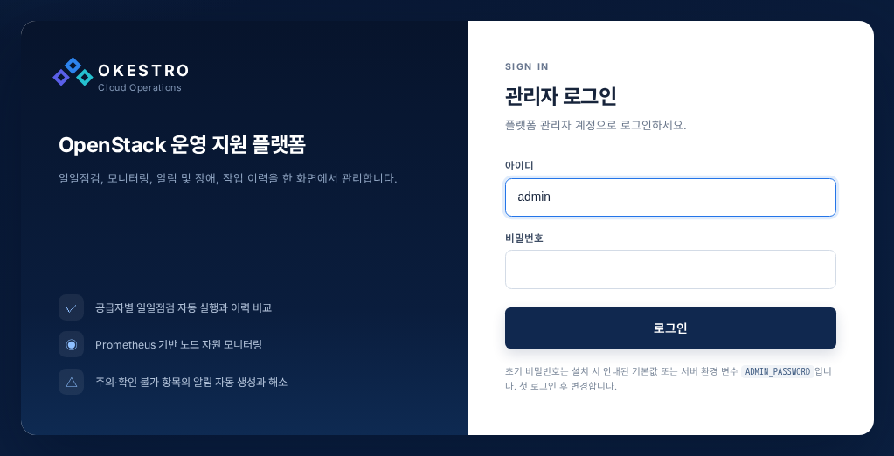
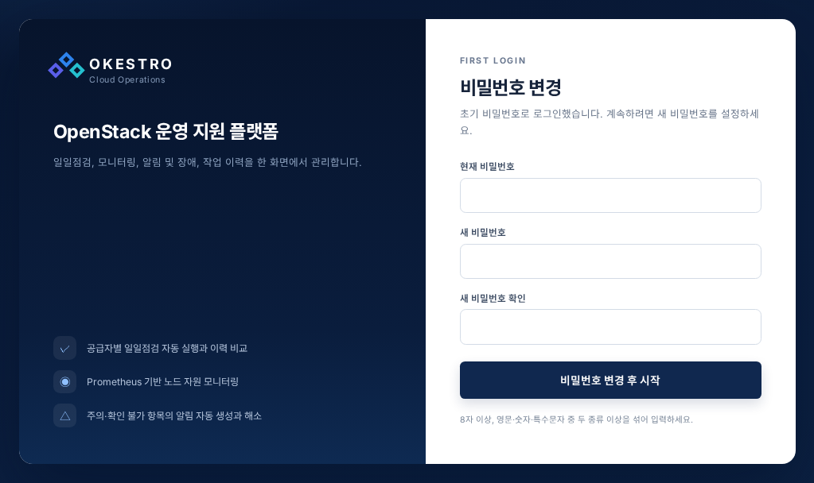
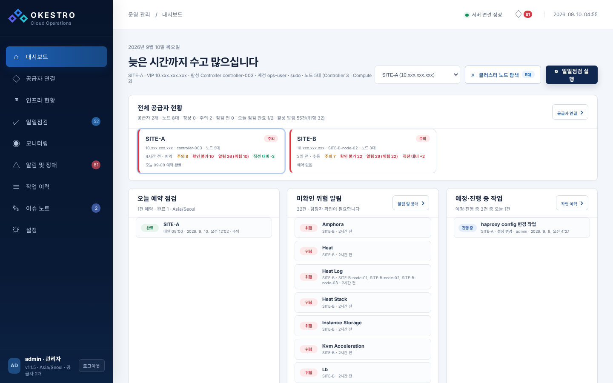
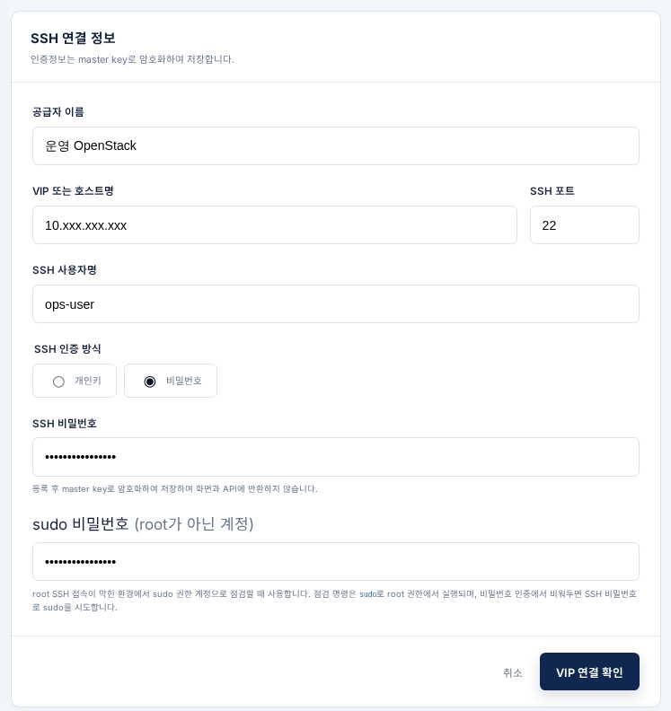
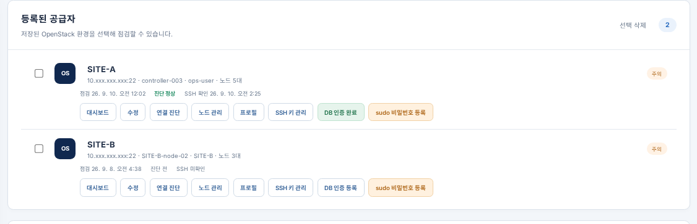
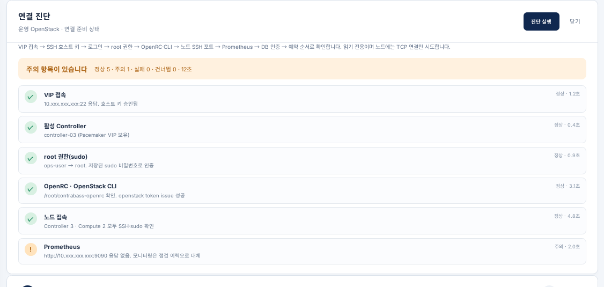
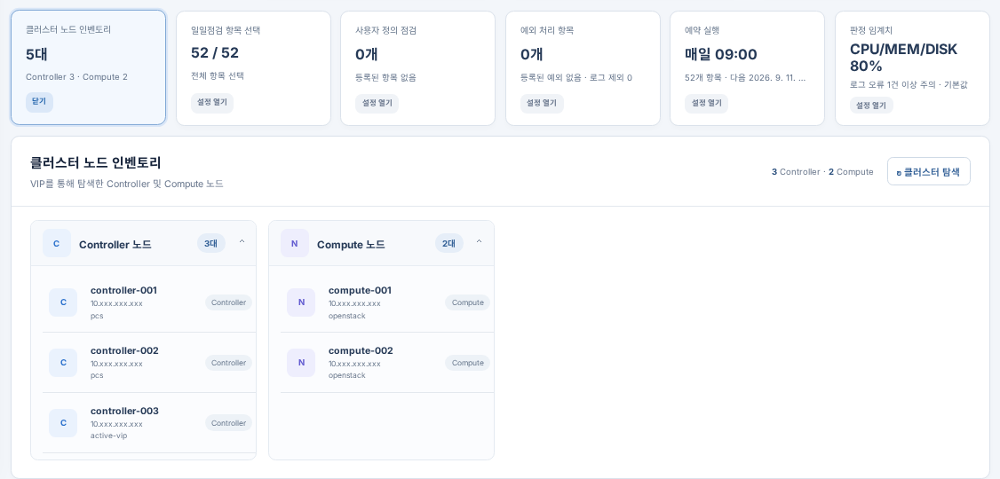
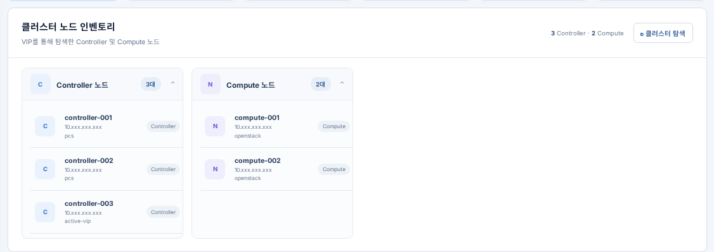
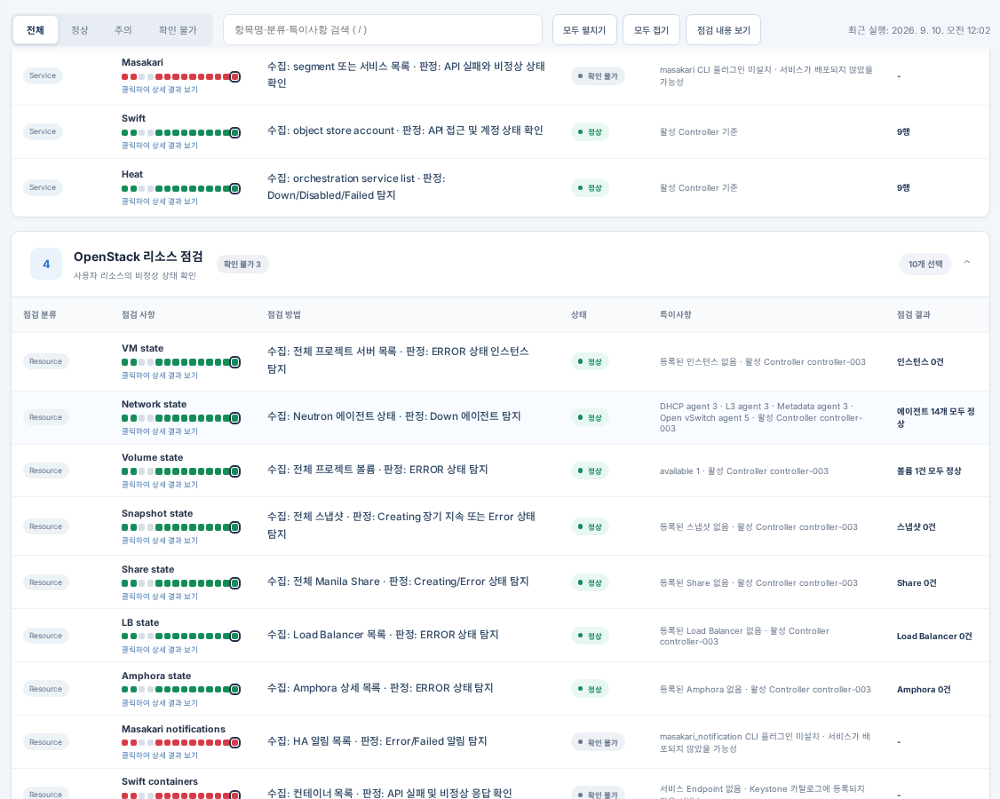

# 폐쇄망 반입 가이드

OpenStack 운영 지원 플랫폼을 인터넷이 없는 서버에 설치하고, 첫 점검을 돌리기까지의 안내서입니다.

| | |
|---|---|
| 플랫폼 번들 | 1.1.5 |
| 런타임 번들 | nerdctl-full 2.3.5 (컨테이너 런타임이 없는 서버에만 필요) |
| 대상 서버 | linux/amd64, systemd |
| 반입 용량 | 361MB (플랫폼 87MB + 런타임 274MB) |
| 기준일 | 2026-09-10 |

## 이 문서는

- **누구를 위한 것인가** — 배포 서버에 접속해 명령을 칠 수 있고, OpenStack 노드의 SSH 계정을
  알고 있는 운영 담당자를 위한 것입니다. 컨테이너나 이 플랫폼을 몰라도 됩니다.
- **얼마나 걸리나** — 파일이 서버에 올라와 있다면 첫 점검 결과까지 **약 40분**입니다. 절반은
  기다리는 시간입니다.
- **어떻게 읽나** — 1단계부터 8단계까지 순서대로 진행합니다. 각 단계는 *할 일 → 이렇게 보이면
  성공 → 안 되면* 순서로 되어 있습니다. 막히면 그 단계의 「안 되면」과 맨 뒤의 「자주 겪는 문제」를
  보세요.

### 전체 흐름

| 단계 | 할 일 | 권한 | 시간 |
|---|---|---|---|
| 1 | 반입한 파일이 온전한지 확인 | 일반 | 2분 |
| 2 | 컨테이너 런타임 설치 — *런타임이 이미 있으면 건너뜀* | root | 5분 |
| 3 | 플랫폼 설치 | root | 5분 |
| 4 | 첫 로그인과 비밀번호 변경 | — | 3분 |
| 5 | OpenStack 환경(공급자) 등록 | — | 5분 |
| 6 | 연결 진단 | — | 2분 |
| 7 | 노드 탐색과 첫 점검 | — | 5분 + 점검 시간 |
| 8 | 백업과 자동 기동 설정 | root | 5분 |

### 상황별로 어디부터 보면 되나

| 상황 | 시작할 곳 |
|---|---|
| 서버에 docker·podman·nerdctl 중 아무것도 없음 | 1단계부터 순서대로 |
| 서버에 컨테이너 런타임이 이미 있음 | 1단계 → **2단계는 건너뛰고** 3단계 |
| 1.1.4 를 쓰고 있고 1.1.5 로 올리려 함 | 부록 B |
| 설치는 됐는데 점검이 실패함 | 「네트워크: 어느 층에서 막혔나」와 「자주 겪는 문제」 |
| 전부 지우고 원래대로 되돌리려 함 | 「되돌리기」 |

---

## 시작하기 전에 — 준비물

아래를 모두 갖춘 뒤 시작하면 중간에 멈추지 않습니다.

### 반입할 파일 (4개)

| 파일 | 크기 | 필요한 경우 |
|---|---|---|
| `openstack-ops-platform-1.1.5-offline.tar.gz` | 87MB | 항상 |
| `openstack-ops-platform-1.1.5-offline.tar.gz.sha256` | 1KB | 항상 |
| `openstack-ops-runtime-2.3.5-offline.tar.gz` | 274MB | 서버에 컨테이너 런타임이 없을 때만 |
| `openstack-ops-runtime-2.3.5-offline.tar.gz.sha256` | 1KB | 위와 같음 |

### 배포 서버에 있어야 하는 것

| 항목 | 확인 명령 | 없으면 |
|---|---|---|
| x86_64 | `uname -m` | 설치할 수 없습니다. 이 번들은 amd64 전용입니다 |
| systemd | `systemctl --version` | 런타임을 서비스로 등록할 수 없습니다 |
| iptables | `iptables --version` | 설치가 멈춥니다. 「네트워크」의 host 방식으로 우회할 수 있습니다 |
| tar · sha256sum | `tar --version` | 압축 해제와 검증에 씁니다 |
| root 또는 sudo | `sudo -v` | 2·3·8단계는 root 권한이 필요합니다 |
| 빈 포트 하나 | `ss -ltn` | 기본 8090. 쓰고 있으면 3단계에서 다른 값으로 바꿉니다 |

### 미리 알아 둘 정보 (5단계에서 입력)

| 정보 | 예 | 비고 |
|---|---|---|
| OpenStack 대표 VIP 또는 Controller 주소 | `10.10.10.100` | 활성 Controller 에 SSH 로 닿는 주소 |
| SSH 포트 | `22` | |
| SSH 계정 | `ops-user` | root 가 아니어도 됩니다 |
| SSH 인증 | 비밀번호 **또는** 개인키 파일 | 개인키에 암호가 걸려 있으면 그 암호도 |
| **sudo 비밀번호** | | root 가 아닌 계정이면 **반드시** 필요합니다. 아래 참고 |

> **sudo 비밀번호가 왜 필요한가** — 점검은 노드의 서비스 상태, 로그, DB 를 root 권한으로 읽습니다.
> 플랫폼은 NOPASSWD 설정에 기대지 않고 항상 이 비밀번호로 sudo 인증을 합니다. 등록할 때 실제 노드에
> 접속해 비밀번호가 맞는지 확인하므로 틀린 값은 저장되지 않습니다. 노드 쪽에서는 그 계정이 sudo 를
> 쓸 수 있고, `sudoers` 에 `requiretty` 가 없으면 됩니다. 노드에 설치하는 것은 없습니다.

---

## 1단계. 반입한 파일이 온전한지 확인 (2분)

전송 중에 잘린 파일은 압축은 풀리는데 설치 도중에 실패합니다. 풀기 전에 먼저 맞춰 봅니다.

**할 일** — 파일을 둔 디렉터리에서:

```sh
sha256sum -c openstack-ops-platform-1.1.5-offline.tar.gz.sha256
sha256sum -c openstack-ops-runtime-2.3.5-offline.tar.gz.sha256     # 런타임 번들도 가져왔다면
```

**이렇게 보이면 성공**

```
openstack-ops-platform-1.1.5-offline.tar.gz: OK
openstack-ops-runtime-2.3.5-offline.tar.gz: OK
```

**안 되면** — `FAILED` 가 나오면 그 파일만 다시 반입합니다. 다른 조치는 없습니다.

---

## 2단계. 컨테이너 런타임 설치 (5분, root)

> 서버에 `docker`·`podman`·`nerdctl` 중 하나라도 있으면 **이 단계를 건너뛰고 3단계로** 갑니다.
> `command -v docker podman nerdctl` 로 확인할 수 있습니다.

런타임 번들은 정적 바이너리(nerdctl·containerd·runc·CNI)를 `/usr/local` 아래에 풀고 containerd 를
systemd 서비스로 등록합니다. 패키지를 설치하지 않으므로 RHEL·Rocky·Ubuntu 어디서나 같습니다.
이 단계만 서버 시스템을 고칩니다. 무엇을 고쳤는지는 기록되고, 나중에 그 기록만 되돌릴 수 있습니다.

**할 일**

```sh
tar -xzf openstack-ops-runtime-2.3.5-offline.tar.gz
cd openstack-ops-runtime-2.3.5
sudo ./install-runtime.sh
```

**이렇게 보이면 성공**

```
==============================================
런타임 설치 완료

  이제 플랫폼 번들을 설치하세요.
    cd <플랫폼 번들 디렉터리> && ./install.sh

  되돌리기    ./uninstall-runtime.sh
  설치 기록   /경로/openstack-ops-runtime-2.3.5/installed-manifest.txt
```

`/usr/local/bin 이 PATH 에 없습니다` 라는 경고가 함께 나오면 안내된 `export PATH=...` 를 실행하거나
다시 로그인합니다. 3단계에서 "런타임이 없다" 고 나오는 가장 흔한 원인입니다.

**안 되면**

| 메시지 | 뜻 | 조치 |
|---|---|---|
| `이 서버에는 이미 컨테이너 런타임이 있습니다` | 설치할 필요가 없습니다 | 3단계로 갑니다 |
| `iptables 가 없습니다` | 브리지 네트워크를 만들 수 없습니다 | `sudo ./install-runtime.sh --no-bridge` 로 설치하고, 3단계에서 `USE_HOST_NETWORK=yes` 로 씁니다 |
| `컨테이너 브리지 대역 ... 이 서버의 기존 경로와 겹칩니다` | 컨테이너 대역(기본 `10.4.0.0/24`)이 사내망과 충돌 | `sudo ./install-runtime.sh --cni-subnet 172.31.240.0/24` 처럼 안 겹치는 대역을 지정합니다 |

---

## 3단계. 플랫폼 설치 (5분, root)

이미지를 적재하고 컨테이너 하나를 띄웁니다. 번들 디렉터리 **밖에는 아무것도 만들지 않습니다.**
데이터도 번들 안 `data/` 에 쌓입니다.

**할 일 ① — 압축 해제와 설정**

```sh
tar -xzf openstack-ops-platform-1.1.5-offline.tar.gz
cd openstack-ops-platform-1.1.5
cp config.env.example config.env
```

`config.env` 를 열어 필요한 것만 고칩니다. 대부분 그대로 둡니다.

| 항목 | 기본값 | 언제 고치나 |
|---|---|---|
| `HOST_PORT` | `8090` | 이 포트를 이미 다른 서비스가 쓸 때 |
| `TIMEZONE` | `Asia/Seoul` | 예약 점검 시각의 기준. 다른 시간대면 |
| `USE_HOST_NETWORK` | `no` | 2단계를 `--no-bridge` 로 했거나, 노드가 사설망에 흩어져 있을 때 `yes` (「네트워크」 참고). `yes` 면 포트는 8090 고정 |
| `ACCESS_HOST` | 비움 | 설치 완료 화면에 표시할 접속 주소. 비우면 서버 첫 IP |

**할 일 ② — 설치**

```sh
sudo env "PATH=$PATH" ./install.sh
```

> **`env "PATH=$PATH"` 를 빼먹지 마세요.** `sudo` 는 PATH 를 좁혀서 `/usr/local/bin` 의 nerdctl 을
> 못 볼 수 있고, 그러면 "런타임이 없다" 며 멈춥니다. 런타임을 방금 설치한 서버에서 가장 흔한 실패입니다.

**이렇게 보이면 성공** — 6단계가 차례로 지나가고 마지막에 접속 정보가 나옵니다.

```
[1/6] 실행 환경 확인
  [OK] 아키텍처 x86_64
  [OK] 컨테이너 런타임 nerdctl
[2/6] 설정 파일
  [OK] config.env 가 이미 있어 그대로 씁니다.
[3/6] 이미지 적재
  [OK] 이미지 무결성 확인
  [OK] openstack-ops-platform:1.1.5
[4/6] 데이터 디렉터리
  [OK] 새 데이터 디렉터리: /경로/openstack-ops-platform-1.1.5/data
[5/6] 컨테이너 기동
  [OK] 컨테이너 시작: openstack-ops-platform
[6/6] 동작 확인
  [OK] /api/health 응답 정상
==============================================
설치 완료

  접속 주소   http://10.10.10.5:8090/
  계정        admin
  비밀번호    Okestro2018@   (첫 로그인에서 반드시 변경합니다)
```

**안 되면**

| 메시지 | 조치 |
|---|---|
| `docker, podman, nerdctl 중 어느 것도 없습니다` | 위의 `env "PATH=$PATH"` 를 붙였는지 확인합니다. 그래도 안 되면 `sudo OPS_RUNTIME=/usr/local/bin/nerdctl ./install.sh` |
| `8090 포트가 이미 사용 중입니다` | `config.env` 의 `HOST_PORT` 를 바꾸고 다시 실행합니다. 기존 서비스는 건드리지 않습니다 |
| `컨테이너 소유를 확인하지 못했습니다` | 같은 이름의 컨테이너가 있는데 이 번들의 것이 아닙니다. `config.env` 의 `CONTAINER_NAME` 을 바꿉니다 |
| `기동 실패. 컨테이너는 정지시켰습니다` | `./opsctl.sh logs` 로 기동 로그를 봅니다. 재시작 루프를 막기 위해 컨테이너는 정지된 상태입니다 |

---

## 4단계. 첫 로그인과 비밀번호 변경 (3분)

**할 일** — 브라우저에서 설치 완료 화면의 접속 주소를 엽니다. 아이디 `admin`, 비밀번호 `Okestro2018@`.



초기 비밀번호로 처음 들어오면 바로 비밀번호 변경 화면이 나옵니다. 건너뛸 수 없습니다.
새 비밀번호(8자 이상, 영문·숫자·특수문자 중 두 종류 이상)를 두 번 넣고 **비밀번호 변경 후 시작**을 누릅니다.



**이렇게 보이면 성공** — 대시보드가 열립니다. 아직 등록한 환경이 없어 비어 있는 것이 정상입니다.



왼쪽 아래에 지금 돌고 있는 버전과 시간대가 표시됩니다. 문의할 때 이 값을 알려 주세요.


**안 되면**

| 증상 | 조치 |
|---|---|
| 페이지가 열리지 않음 | 서버에서 `./opsctl.sh status`. 컨테이너가 떠 있는데 안 열리면 사내 방화벽에서 그 포트를 확인합니다 |
| 로그인이 계속 실패 | 한 IP 에서 5번 틀리면 5분 동안 잠깁니다. 잠시 뒤 다시 시도합니다 |
| 비밀번호를 잊음 | `config.env` 에 `ADMIN_PASSWORD=<새 비밀번호>` 와 `ADMIN_PASSWORD_RESET=1` 을 넣고 `./opsctl.sh restart`. 로그인한 뒤 두 줄을 지우고 다시 `restart` |

---

## 5단계. OpenStack 환경(공급자) 등록 (5분)

플랫폼은 OpenStack 환경 하나를 **공급자**라고 부릅니다. 대표 VIP 와 SSH 계정을 등록하면 그 뒤로는
이 공급자를 골라 점검·모니터링을 합니다. 환경이 여럿이면 각각 등록합니다.

**할 일** — 왼쪽 메뉴 **공급자 연결** → 오른쪽의 「SSH 연결 정보」에 준비한 값을 넣습니다.



| 칸 | 넣는 것 |
|---|---|
| 공급자 이름 | 화면에 표시할 이름. 예: `운영 OpenStack` |
| VIP 또는 호스트명 | 대표 VIP. 이름이 아니라 **IP** 를 권장합니다 (아래 참고) |
| SSH 포트 · 사용자명 | 노드의 SSH 포트와 계정 |
| SSH 인증 방식 | 개인키 파일을 올리거나 비밀번호를 넣습니다 |
| sudo 비밀번호 | root 가 아닌 계정이면 넣습니다. 비워 두면 SSH 비밀번호로 sudo 를 시도합니다 |

**VIP 연결 확인**을 누르면 실제로 SSH 접속을 시도합니다. 처음 접속하는 서버라 **SSH 지문(호스트 키)**
을 보여 주는데, 이것이 그 서버가 맞는지 확인하고 승인합니다. 승인한 지문은 저장되어 다음부터 묻지
않습니다. 그 다음 sudo 비밀번호를 노드에서 검증하고, 맞으면 저장합니다.

**이렇게 보이면 성공** — 왼쪽 「등록된 공급자」 목록에 카드가 생깁니다. 카드의 버튼으로 이 공급자에
관한 모든 것을 합니다.



> 카드에 **sudo 비밀번호 등록** 배지가 노란색이면 아직 sudo 비밀번호가 없다는 뜻입니다. 이 상태로는
> 점검이 권한 부족으로 실패하므로 그 버튼을 눌러 등록합니다. 1.1.4 에서 올라온 공급자가 이 상태입니다.

> **이름 대신 IP 를 권장하는 이유** — 컨테이너는 서버의 `/etc/hosts` 를 물려받지 않습니다. 서버에서는
> `controller-01` 로 접속되어도 컨테이너 안에서는 그 이름을 못 찾을 수 있습니다.

**안 되면**

| 메시지 | 뜻 | 조치 |
|---|---|---|
| 연결 시간 초과 | 컨테이너에서 VIP 로 가는 길이 없습니다 | 「네트워크: 어느 층에서 막혔나」 |
| 인증 실패 | SSH 비밀번호·키가 틀렸습니다 | 서버에서 같은 계정으로 직접 `ssh` 해 봅니다 |
| sudo 비밀번호가 맞지 않습니다 | sudo 인증 실패 | 노드에서 `sudo -k; sudo -v` 로 그 비밀번호가 맞는지 확인합니다 |
| sudoers 에 등록되지 않은 계정 | 그 계정에 sudo 권한이 없습니다 | 노드 관리자에게 sudo 권한을 요청합니다 |
| requiretty 로 차단 | 노드의 `sudoers` 가 터미널 없는 sudo 를 막습니다 | 노드 `sudoers` 에서 그 계정에 `!requiretty` 를 적용합니다 |

---

## 6단계. 연결 진단 (2분)

등록만으로는 VIP 접속까지만 확인한 것입니다. 진단은 점검에 필요한 모든 것을 한 번에 훑어, 어디까지
준비됐고 무엇이 모자란지 보여 줍니다. **읽기 전용**이라 노드에 아무 변화도 주지 않습니다.

**할 일** — 공급자 카드의 **연결 진단** 을 누릅니다. 1~2분 걸립니다.



| 진단 항목 | 무엇을 보나 | 실패하면 |
|---|---|---|
| VIP 접속 | SSH 포트 응답과 호스트 키 | 「네트워크」 |
| 활성 Controller | VIP 를 가진 Controller 확인 | Pacemaker 가 없는 환경이면 VIP 로 접속된 그 노드를 씁니다 |
| root 권한(sudo) | 저장된 sudo 비밀번호로 root 획득 | 5단계의 「안 되면」 |
| OpenRC · OpenStack CLI | Controller 의 `/root/contrabass-openrc` 와 `openstack` 명령 | OpenRC 파일 경로가 다르면 문의하세요 |
| 노드 접속 | 탐색된 모든 노드에 SSH·sudo | 특정 노드만 실패하면 그 노드의 계정·sudoers 를 봅니다 |
| Prometheus | 있으면 메트릭 연동 | **주의**로 표시되지만 점검에는 지장 없습니다. 모니터링 화면이 점검 이력을 대신 씁니다 |

**이렇게 보이면 성공** — 맨 위 요약이 **연결 준비 완료** 또는 Prometheus 만 주의인 **주의 항목이
있습니다** 입니다. 실패가 하나라도 있으면 그 항목을 고친 뒤 **진단 실행**으로 다시 돌립니다.

---

## 7단계. 노드 탐색과 첫 점검 (5분 + 점검 시간)

**할 일 ① — 노드 탐색.** 왼쪽 메뉴 **일일점검** → 위쪽에서 공급자를 고릅니다 → 설정 카드 중
**클러스터 노드 인벤토리** 를 열고 **클러스터 탐색**을 누릅니다. Controller 에 접속해 Pacemaker 와 OpenStack
서비스 목록으로 Controller·Compute 노드를 찾아 옵니다.





탐색되지 않은 노드가 있거나 IP 가 다르면 이 화면에서 **직접 추가·수정**할 수 있습니다.
탐색은 언제든 다시 할 수 있고, 손으로 고친 것은 보존됩니다.

**할 일 ② — 점검 실행.** 오른쪽 위 **전체 점검 실행**을 누릅니다. 노드 5대 기준 1~2분이며, 진행
상황이 위쪽 요약 카드에 실시간으로 표시됩니다. 도중에 멈추려면 진행 표시줄 옆의 **취소**를 누릅니다.


**이렇게 보이면 성공** — 아래 체크리스트에 항목별 결과가 채워집니다. 각 항목을 누르면 노드별 상세와
실제 명령 출력을 볼 수 있습니다.



| 판정 | 뜻 |
|---|---|
| 정상 | 기준 안 |
| 주의 | 임계치를 넘었거나 확인이 필요한 상태. 판정 기준은 설정 카드 **판정 임계치** 에서 바꿉니다 |
| 확인 불가 | 명령이 실패했거나 제한 시간을 넘겼거나 권한이 없었습니다. 상세에 사유가 있습니다 |

> **확인 불가가 많으면** 거의 항상 sudo 입니다. 6단계 진단의 「root 권한」 항목을 먼저 확인하세요.
> 플랫폼은 권한이 없을 때 일반 권한으로 대신 실행하지 않습니다. 로그를 읽지 못한 채 "정상" 으로
> 오판하는 것보다 확인 불가로 표시하는 편이 낫기 때문입니다.

점검은 한 번 돌리면 결과가 이력으로 남고, 설정 카드 **예약 실행** 에서 매일 정해진 시각에 자동으로 돌게 할
수 있습니다. 결과는 **PDF 저장** 으로 내려받을 수 있습니다.

---

## 8단계. 백업과 자동 기동 (5분, root)

### 백업

공급자 등록과 첫 점검을 마쳤으면 한 번 백업해 둡니다. 컨테이너를 잠깐 멈추고 `data/` 를 묶은 뒤
다시 올립니다.

```sh
./opsctl.sh backup
```

> **백업 파일은 비밀번호 금고입니다.** 안에 SSH·sudo·DB 비밀번호를 푸는 마스터 키가 들어 있습니다.
> 접근이 통제된 곳에 두세요. 파일 권한은 600 으로 만들어집니다.

### 재부팅 후 자동 기동

서버가 재부팅되면 컨테이너는 스스로 올라오지 않습니다. systemd 유닛을 하나 두어 켜 줍니다.

```sh
sudo ./opsctl.sh install-service
```

유닛 파일을 만들기 전에 검증하고, 같은 이름의 유닛이 이 번들의 것이 아니면 덮어쓰지 않습니다.
설치한 경로는 `installed-service.txt` 에 기록되고, `sudo ./opsctl.sh uninstall-service` 는 거기 적힌
것만 지웁니다.

> 재부팅 창이 있으면 한 번 실제로 재부팅해 `./opsctl.sh status` 가 정상인지 확인해 두세요.
> 런타임 번들로 설치한 서버라면 containerd 가 먼저 올라와야 하므로 이 확인이 특히 중요합니다.

---

## 네트워크: 어느 층에서 막혔나

플랫폼은 **컨테이너 안에서** 노드로 SSH 를 나갑니다. 화면은 잘 열리는데 등록이나 점검만 실패한다면
대개 컨테이너에서 노드로 가는 길이 없는 것입니다. 어느 층인지부터 확인합니다.

```sh
./opsctl.sh netcheck 10.10.10.100          # 노드 IP, 기본 포트 22
./opsctl.sh netcheck 10.10.10.100 2222     # SSH 포트가 다르면
```

컨테이너 안과 서버 양쪽에서 이름 해석 → 경로 → TCP 접속 → SSH 응답을 차례로 확인하고, 두 결과의
조합으로 조치를 알려 줍니다.

| 컨테이너 | 서버 | 뜻 | 조치 |
|---|---|---|---|
| 성공 | 성공 | 네트워크는 문제가 아닙니다 | 계정·키·sudo 를 봅니다 (5·6단계) |
| **실패** | 성공 | 브리지 네트워크가 사설망에 닿지 못합니다 | `config.env` 에 `USE_HOST_NETWORK=yes` → `./opsctl.sh restart` |
| 이름 해석 실패 | — | 컨테이너는 서버의 `/etc/hosts` 를 모릅니다 | 노드 인벤토리에 **IP 를 직접** 넣습니다 |
| 실패 | 실패 | 서버 밖의 문제입니다 | 라우팅·방화벽·노드 `sshd`. 컨테이너 문제가 아닙니다 |
| 열림, SSH 아님 | | 포트가 다르거나 앞에 다른 장비가 있습니다 | 노드의 실제 SSH 포트를 확인합니다 |

### 브리지와 host, 무엇을 고를까

| | 브리지 (기본) | host |
|---|---|---|
| 설정 | `USE_HOST_NETWORK=no` | `USE_HOST_NETWORK=yes` |
| 포트 | `HOST_PORT` 로 자유롭게 | 8090 고정 |
| 컨테이너의 출발지 IP | 컨테이너 대역(`10.4.x`)에서 NAT | 서버 IP 그대로 |
| 이럴 때 | 노드가 서버와 같은 대역에 있고 포트를 바꾸고 싶을 때 | 노드가 사설망 곳곳에 있거나, 노드 방화벽이 출발지 IP 로 허용할 때. 노드 쪽 허용 규칙이 **서버 IP 하나**로 끝납니다 |

확신이 없으면 **host** 를 권합니다. 문제가 생길 층이 하나 줄어듭니다. 2단계에서 `--no-bridge` 로
설치했다면 host 만 가능합니다.

---

## 자주 겪는 문제

| 증상 | 원인 | 조치 |
|---|---|---|
| `install.sh` 가 "런타임이 없다" 고 함 | `sudo` 가 PATH 를 좁혔습니다 | `sudo env "PATH=$PATH" ./install.sh` |
| 설치는 됐는데 브라우저에서 안 열림 | 사내 방화벽 | `./opsctl.sh status` 로 컨테이너가 떠 있는지 확인한 뒤 서버 방화벽에서 포트를 엽니다 |
| 화면은 열리는데 공급자 등록·점검이 실패 | 컨테이너에서 노드로 가는 길이 없음 | 위 「네트워크」의 `netcheck` |
| 공급자 카드에 노란 **sudo 비밀번호 등록** 배지 | sudo 비밀번호 미등록 | 그 버튼을 눌러 등록합니다 |
| 점검 결과가 온통 확인 불가 | 권한 상승 실패 | 6단계 진단의 root 권한 항목 |
| 특정 노드만 확인 불가 | 그 노드의 계정·sudoers·방화벽 | 서버에서 그 노드로 직접 `ssh` 후 `sudo -v` |
| 노드 이름이 해석되지 않음 | 컨테이너는 `/etc/hosts` 를 모릅니다 | 인벤토리에 IP 직접 입력 |
| 화면 글꼴이 깨짐 | 브라우저가 옛 파일을 캐시 | 강력 새로고침 (Ctrl+Shift+R). 글꼴은 이미지 안에 있어 인터넷이 필요 없습니다 |
| 로그인 5번 실패 후 잠김 | 무차별 대입 방지 | 5분 뒤 다시. 급하면 `./opsctl.sh restart` 로 풀립니다 |
| 비밀번호를 잊음 | | 4단계 「안 되면」의 `ADMIN_PASSWORD_RESET` |
| `config.env` 를 고쳤는데 반영이 안 됨 | 재기동 전 | `./opsctl.sh restart` |

문의할 때는 왼쪽 아래의 버전 표시와 `./opsctl.sh status` 출력, 그리고 `./opsctl.sh logs` 의 마지막
50줄 정도를 함께 보내 주세요.

---

## 되돌리기

설치의 역순입니다. 무엇이든 지우기 전에 그것이 이 번들의 것인지 확인하므로, 같은 서버의 다른
컨테이너나 파일은 건드리지 않습니다.

```sh
cd /경로/openstack-ops-platform-1.1.5
sudo ./opsctl.sh uninstall-service     # 8단계에서 유닛을 설치했다면
./opsctl.sh backup                     # 데이터를 남기려면 먼저
./opsctl.sh remove --all               # 컨테이너 · 이미지 · data/
cd .. && sudo rm -rf openstack-ops-platform-1.1.5

cd /경로/openstack-ops-runtime-2.3.5   # 2단계에서 런타임을 설치했다면
sudo ./uninstall-runtime.sh            # 설치 기록에 적힌 것만 되돌립니다
```

`remove --all` 대신 `remove` 만 하면 `data/` 는 남습니다. 백업 파일에는 마스터 키가 들어 있으니
남길 필요가 없으면 함께 지우세요.

---

## 부록 A. 반입 파일 안에 있는 것

### 플랫폼 번들 `openstack-ops-platform-1.1.5-offline.tar.gz`

| 파일 | 용도 |
|---|---|
| `image/openstack-ops-platform-1.1.5.tar` + `image/SHA256SUMS` | 컨테이너 이미지 (적재 후 약 273MB). 설치 때 자체 검증합니다 |
| `install.sh` | 설치 |
| `opsctl.sh` · `lib.sh` · `restore_archive.py` | 운영 명령 (부록 C) |
| `config.env.example` · `compose.yaml` | 설정 서식 |
| `systemd/` | 자동 기동 유닛 서식 |
| `README-DEPLOY.md` | 상세 배포 안내 |
| `VERSION` | 릴리스·빌드 시각·소스 커밋 |

이미지는 `python:3.12-slim` 기반이며 화면 글꼴까지 안에 들어 있어 인터넷 없이 완전히 동작합니다.
노드 SSH 는 파이썬 라이브러리로 직접 처리하므로 이미지 안에 `ssh`·`curl`·`ping` 이 **없습니다.**
컨테이너 안에서 진단하려 하지 말고 `./opsctl.sh netcheck` 를 쓰세요.

### 런타임 번들 `openstack-ops-runtime-2.3.5-offline.tar.gz`

| 구성 | 버전 | 구성 | 버전 |
|---|---|---|---|
| nerdctl | 2.3.5 | CNI plugins | 1.9.1 |
| containerd | 2.3.3 | BuildKit | 0.31.2 |
| runc | 1.5.1 | fuse-overlayfs | 1.17 |

상위 배포처의 `nerdctl-full` 압축 파일을 **다시 묶지 않고 그대로** 담았습니다. 사이트에서 상위
배포처가 공개한 SHA256 으로 직접 검증할 수 있습니다. `install-runtime.sh`·`uninstall-runtime.sh`·
`README-RUNTIME.md` 가 함께 들어 있습니다.

### 서버에 남는 것

| 무엇이 | 어디에 | 되돌리기 |
|---|---|---|
| 컨테이너 1개 · 이미지 1개 | 런타임의 전용 namespace `openstack-ops` | `./opsctl.sh remove` |
| 공급자 DB · 마스터 키 · 점검 이력 | 번들 안 `data/` | `./opsctl.sh remove --all` |
| 자동 기동 유닛 (8단계를 했을 때만) | `/etc/systemd/system/` | `sudo ./opsctl.sh uninstall-service` |
| 런타임 바이너리·containerd 서비스·CNI 설정·커널 파라미터 (2단계를 했을 때만) | `/usr/local`, `/etc/systemd/system`, `/etc/cni/net.d`, `/etc/sysctl.d`, `/etc/modules-load.d` | `sudo ./uninstall-runtime.sh` — `installed-manifest.txt` 에 적힌 것만 |

같은 서버의 k8s 나 다른 컨테이너에는 영향을 주지 않습니다. 전용 namespace 를 쓰고, 지우기 전에
항상 자기 것인지 확인합니다.

---

## 부록 B. 1.1.4 에서 1.1.5 로 올리기

새 번들을 **별도 디렉터리**에 풀고 데이터를 옮깁니다. 데이터 형식은 같아 그대로 옮기면 됩니다.

```sh
cd /경로/openstack-ops-platform-1.1.4
./opsctl.sh backup && ./opsctl.sh stop

cd .. && tar -xzf openstack-ops-platform-1.1.5-offline.tar.gz
cd openstack-ops-platform-1.1.5
cp -a ../openstack-ops-platform-1.1.4/data ./data
cp ../openstack-ops-platform-1.1.4/config.env ./config.env
sudo env "PATH=$PATH" ./install.sh
```

`config.env` 를 복사했다면 `IMAGE_TAG` 줄을 `1.1.5` 로 고칩니다. 새 버전이 정상 동작하는 것을
확인한 뒤 이전 디렉터리를 지우세요.

**올린 뒤 해야 할 것 하나** — 1.1.4 는 노드가 NOPASSWD 면 sudo 비밀번호 없이 권한을 얻었습니다.
1.1.5 는 항상 저장된 sudo 비밀번호를 씁니다. 기존 공급자는 카드에 노란 **sudo 비밀번호 등록** 배지가
붙고, 등록 전까지 점검이 권한 실패로 나옵니다. 각 공급자에서 한 번 등록하면 끝입니다.

이 밖에 `data/` 에 `providers.db-wal`·`providers.db-shm` 파일이 새로 생기는데(점검 중에도 화면이
막히지 않게 하는 SQLite 설정) 정상입니다. 백업·복원이 알아서 다룹니다. 화면 파일의 캐시 무효화는
자동이 되어 강력 새로고침이 더는 필요 없습니다.

---

## 부록 C. 운영 명령 요약

모두 번들 디렉터리에서 `./opsctl.sh <명령>` 으로 실행합니다.

| 명령 | 하는 일 | root |
|---|---|---|
| `status` | 런타임·컨테이너·응답·데이터 크기를 한눈에 | |
| `logs` / `logs -f` | 컨테이너 로그 / 실시간 | |
| `restart` | 재기동. `config.env` 를 고친 뒤 | |
| `stop` / `start` | 정지 / 기동. 데이터는 남습니다 | |
| `netcheck <IP> [포트]` | 컨테이너 안·서버 양쪽에서 노드 SSH 경로 확인 | |
| `backup` | `data/` 를 tar.gz 로. 잠깐 정지 후 재기동 | |
| `restore <파일>` | 백업에서 복원. 이전 데이터는 `data.before-restore.*` 로 보존 | |
| `install-service` / `uninstall-service` | 재부팅 자동 기동 유닛 설치 / 제거 | ✓ |
| `remove` / `remove --all` | 컨테이너·이미지 제거 / 데이터까지 | |
| `shell` | 컨테이너 안 셸. 진단 도구가 없으니 보통 쓸 일이 없습니다 | |

---

## 부록 D. 이 번들은 어떻게 검증됐나

1.1.5 번들은 배포 전에 nerdctl 이 설치된 서버에서 이 문서의 절차를 처음부터 끝까지 실제로 돌려
확인했습니다 — 체크섬 검증, 설치, 로그인과 비밀번호 변경, 백업, 정상 백업과 손상된 백업의 복원,
재기동, 자동 기동 유닛 설치·제거, 전체 제거. 같은 서버에서 돌고 있던 다른 서비스에는 영향이 없었습니다.

사이트에서만 확인할 수 있어 남아 있는 것은 네 가지입니다. 실제 노드에 대한 sudo 비밀번호 인증,
실제 재부팅 후 자동 기동, docker·podman 런타임, 런타임이 없는 서버에서의 런타임 번들 설치. 이 중
어느 것이든 문제가 나타나면 「자주 겪는 문제」의 안내대로 정보를 모아 알려 주세요.

---

OpenStack 운영 지원 플랫폼 · 플랫폼 번들 1.1.5 · 런타임 번들 2.3.5 · 2026-09-10 기준
더 자세한 내용은 번들 안의 `README-DEPLOY.md` 와 `README-RUNTIME.md` 에 있습니다.
